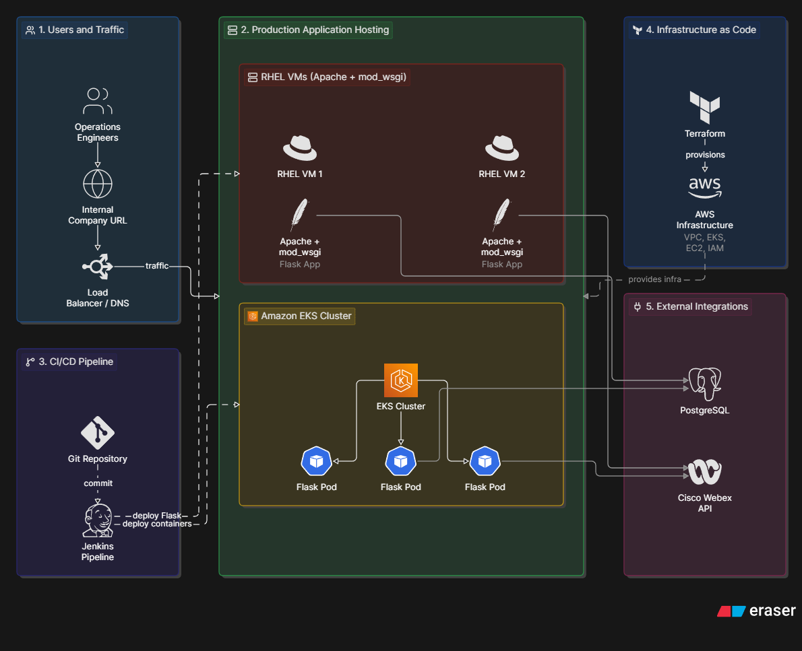

# Infrastructure Automation Platform

## Overview
Brief explanation of the problem:
- Manual infrastructure monitoring
- Slow incident communication
- Operational overhead during outages

## Architecture

## Architecture

The following diagram illustrates the production architecture, deployment workflow, and infrastructure components of the platform.

Description of:
- RHEL application environment
- Amazon EKS deployment
- Jenkins CI/CD pipeline
- Terraform-managed AWS infrastructure
- PostgreSQL database
- Webex notifications

## Problem

During network outages, operations teams needed better visibility into infrastructure impact and remaining capacity.

Example:
- Multiple datacenter circuits experienced failures
- Remaining circuit utilization became critical
- Manual status updates slowed response

## Solution

Built a Python Flask automation platform that:
- Collected infrastructure information
- Automated operational workflows
- Delivered real-time notifications through Cisco Webex
- Improved visibility during incidents

## Deployment Architecture

### Application Layer
- Python Flask
- Apache/mod_wsgi
- Kubernetes/EKS

### CI/CD
- Jenkins
- Automated deployments

### Infrastructure
- AWS
- Terraform
- Infrastructure as Code

## Design Decisions

### Why Terraform?
Terraform was used to manage AWS infrastructure through Infrastructure as Code (IaC), allowing infrastructure changes to be defined, reviewed, and deployed consistently across environments.

Instead of manually creating and configuring AWS resources, Terraform provided a repeatable approach for provisioning and maintaining infrastructure. This improved reliability by reducing configuration drift, enabled version control of infrastructure changes, and made it easier to reproduce environments when updates or new deployments were required.

Terraform also provided better visibility into infrastructure changes through its plan/apply workflow, allowing changes to be reviewed before being introduced into production.

Key points:

- Infrastructure defined as code and stored in version control
- Reduced manual AWS configuration
- Improved consistency across environments
- Minimized configuration drift
- Enabled repeatable infrastructure deployments

### Why Kubernetes/EKS?
Amazon EKS was used to provide a scalable and standardized platform for running containerized versions of the Flask application. Kubernetes provided automated scheduling, service management, and workload orchestration, allowing the application to run reliably across multiple nodes.

Moving workloads into Kubernetes improved deployment consistency by packaging the application and its dependencies into containers. This reduced environment differences between development and production and enabled more predictable deployments.

EKS also provided capabilities such as automated pod management, scaling, health checks, and service discovery, allowing the application platform to better support production workloads.

Key points:

- Standardized application deployment through containers
- Automated workload scheduling and management
- Improved scalability and availability
- Simplified application lifecycle management
- Reduced "works on my machine" issues

### Why Hybrid Deployment?
The hybrid deployment approach allowed the platform to support existing production environments while adopting cloud-native technologies incrementally.

The RHEL Apache/mod_wsgi deployment provided a stable environment for existing application workloads, while the EKS deployment introduced Kubernetes-based orchestration, containerization, and modern deployment practices.

Maintaining both environments allowed the organization to continue supporting production operations while gradually adopting cloud-native infrastructure patterns. This approach reduced migration risk, enabled flexibility, and allowed teams to leverage existing infrastructure investments while moving toward more scalable deployment models.

Key points:

- Supported existing production workloads
- Enabled gradual cloud-native adoption
- Reduced migration risk
- Allowed comparison between traditional and Kubernetes deployments
- Provided flexibility for future modernization

## Results

- Reduced manual operational effort
- Improved incident communication
- Standardized deployment workflows
- Increased visibility during infrastructure events

## Technologies

Python | Flask | AWS | EKS | Kubernetes | Terraform | Jenkins | RHEL | PostgreSQL
